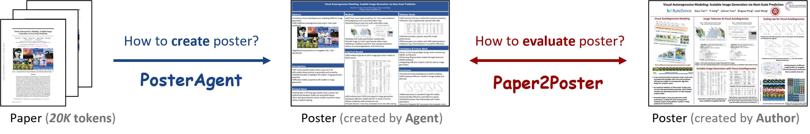

# 🎓 科学论文海报自动化工具

<p align="center">
  
</p>

## 📋 目录

- [项目介绍](#项目介绍)
- [功能特点](#功能特点)
- [安装指南](#安装指南)
- [快速开始](#快速开始)
- [评估方法](#评估方法)

## 项目介绍

这是一个创新的多模态工具，能够自动将科学论文转换为高质量的学术海报。通过先进的人工智能技术，本项目解决了从论文PDF到可编辑PPTX海报的全流程自动化问题，大大提高了学术工作者的效率。能够实现从`paper.pdf`到可编辑`poster.pptx`的全流程转换。

## 功能特点

- **全自动处理**：从PDF论文直接生成结构清晰的学术海报
- **可编辑输出**：生成的海报为PPTX格式，方便进一步编辑和定制
- **智能布局**：自动规划文本和图形的最佳布局，保持阅读顺序和空间平衡
- **多种模型支持**：支持GPT-4o和开源模型如Qwen-2.5-7B-Instruct的灵活组合
- **自动排版优化**：自动检测并修复溢出和对齐问题
- **全面评估系统**：包含多种评估指标，确保海报质量

## 安装指南

本项目支持本地部署（通过[vLLM](https://docs.vllm.ai/en/v0.6.6/getting_started/installation.html)）或API访问（如GPT-4o）。

**Python环境**
```bash
pip install -r requirements.txt
```

**安装LibreOffice**
```bash
sudo apt install libreoffice
```

如果没有sudo权限，可以直接下载`soffice`可执行文件：https://www.libreoffice.org/download/download-libreoffice/，并将可执行目录添加到`$PATH`。

**安装poppler**
```bash
conda install -c conda-forge poppler
```

**API密钥**

在项目根目录创建`.env`文件并添加OpenAI API密钥：

```bash
OPENAI_API_KEY=<你的_openai_api_密钥>
```

## 快速开始

在`{dataset_dir}`下创建名为`{paper_name}`的文件夹，并将论文PDF文件放入该文件夹并命名为`paper.pdf`。
```
📁 {dataset_dir}/
└── 📁 {paper_name}/
    └── 📄 paper.pdf
```

要使用开源模型，需要先使用[vLLM](https://docs.vllm.ai/en/v0.6.6/getting_started/installation.html)部署它们，确保在[`utils/wei_utils.py`](utils/wei_utils.py)的`get_agent_config()`函数中正确指定端口。

- [高性能] 使用`GPT-4o`生成海报：

```bash
python -m 海报生成.new_pipeline \
    --poster_path="${dataset_dir}/${paper_name}/paper.pdf" \
    --model_name_t="4o" \  # 语言模型
    --model_name_v="4o" \  # 视觉模型
    --poster_width_inches=48 \
    --poster_height_inches=36
```

- [经济实惠] 使用`Qwen-2.5-7B-Instruct`和`GPT-4o`生成海报：

```bash
python -m 海报生成.new_pipeline \
    --poster_path="${dataset_dir}/${paper_name}/paper.pdf" \
    --model_name_t="vllm_qwen" \  # 语言模型
    --model_name_v="4o" \         # 视觉模型
    --poster_width_inches=48 \
    --poster_height_inches=36 \
    --no_blank_detection          # 禁用空白检测的选项
```

- [本地部署] 使用`Qwen-2.5-7B-Instruct`生成海报：

```bash
python -m 海报生成.new_pipeline \
    --poster_path="${dataset_dir}/${paper_name}/paper.pdf" \
    --model_name_t="vllm_qwen" \           # 语言模型
    --model_name_v="vllm_qwen_vl" \        # 视觉模型
    --poster_width_inches=48 \
    --poster_height_inches=36
```

本工具**支持语言模型和视觉模型的灵活组合**，欢迎尝试其他选项，或在[`utils/wei_utils.py`](utils/wei_utils.py)的`get_agent_config()`中自定义设置。

## 评估方法

下载评估数据集：
```bash
python -m 海报生成.create_dataset
```

在评估中，论文存储在名为`论文海报数据`的目录下。

使用**问答评估**评估生成的海报：
```bash
python -m 海报评估.eval_poster_pipeline \
    --paper_name="${paper_name}" \
    --poster_method="${model_t}_${model_v}_generated_posters" \
    --metric=qa # 问答评估
```

使用**视觉模型评判**评估生成的海报：
```bash
python -m 海报评估.eval_poster_pipeline \
    --paper_name="${paper_name}" \
    --poster_method="${model_t}_${model_v}_generated_posters" \
    --metric=judge # 视觉模型评判
```

使用其他统计指标（如视觉相似度、PPL等）评估生成的海报：
```bash
python -m 海报评估.eval_poster_pipeline \
    --paper_name="${paper_name}" \
    --poster_method="${model_t}_${model_v}_generated_posters" \
    --metric=stats # 统计指标
```

如果您想为自己的论文创建问答评估：
```bash
python -m 海报评估.create_paper_questions \
    --paper_folder="论文海报数据/${paper_name}"
```

## ❤ Acknowledgement
Gratitude to [🐫CAMEL](https://github.com/camel-ai/camel), [🦉OWL](https://github.com/camel-ai/owl), [Docling](https://github.com/docling-project/docling), [PPTAgent](https://github.com/icip-cas/PPTAgent) for providing their codebases.